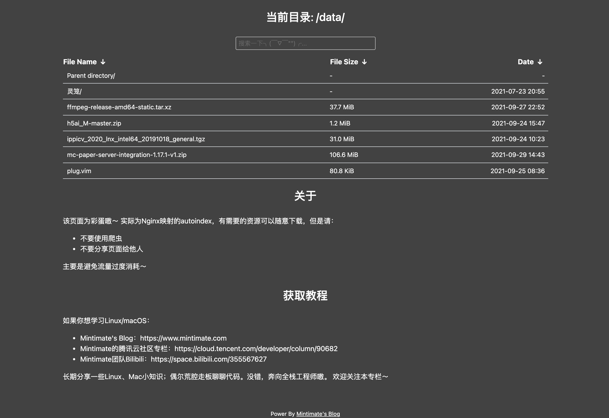
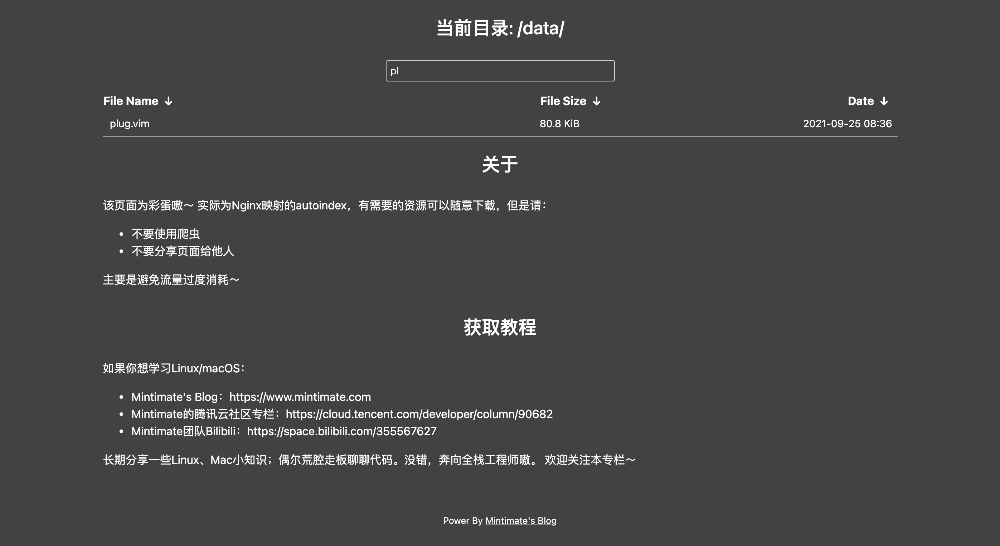

## Nginx-Fancyindex-Theme-Dark
Depend On [Nginx-Fancyindex-Theme](https://github.com/Naereen/Nginx-Fancyindex-Theme）
A responsive theme for [Nginx](https://www.nginx.org/) Fancyindex module. Minimal, modern and simple.
Comes with a search form, aims to handle thousands of files without any problems.

The fancyindex module can be found [here](https://github.com/aperezdc/ngx-fancyindex) (by @aperezdc).

## Usage
1. Thanks To The CDN,Just download the `footer.html` and `header.html` in your Nginx's Web.
2. Include the content of fancyindex.conf in your location directive (location / {.....}) in your nginx config (usually nginx.conf).
3. Reload/Restart Nginx

If you don't how to make a configuration in your Nginx.
Demo:
```
    location ^~/data{
    alias /www/www.mintimate.cn/resources;
    fancyindex on; # 使用fancyindex
    fancyindex_exact_size off; # 不显示精确大小
    fancyindex_header /data/header.html;
    fancyindex_footer /data/footer.html;
    fancyindex_ignore "README.md";
    fancyindex_time_format "%Y-%m-%d %H:%M";
    fancyindex_localtime on;
    }
```

## Examples
### Showing a list of files (without search):

### With search:


## More
If you have any problem:
- Mintimate's Bilibili：[https://space.bilibili.com/355567627](https://space.bilibili.com/355567627))
